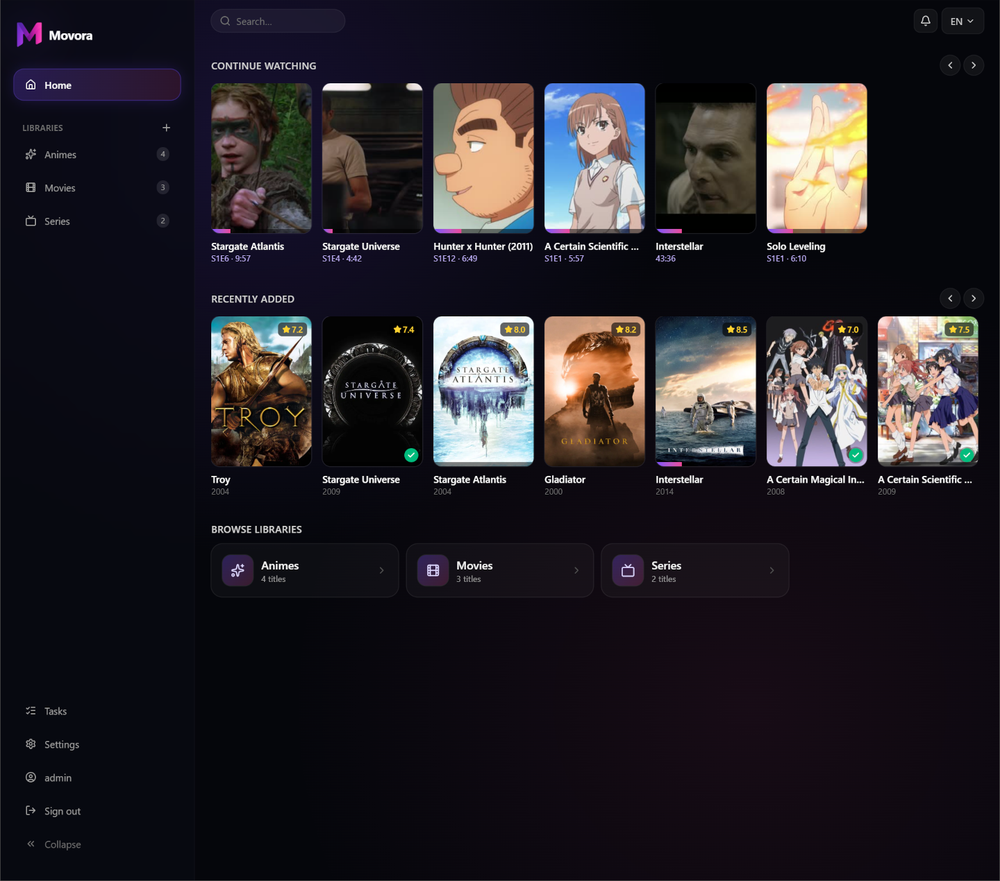
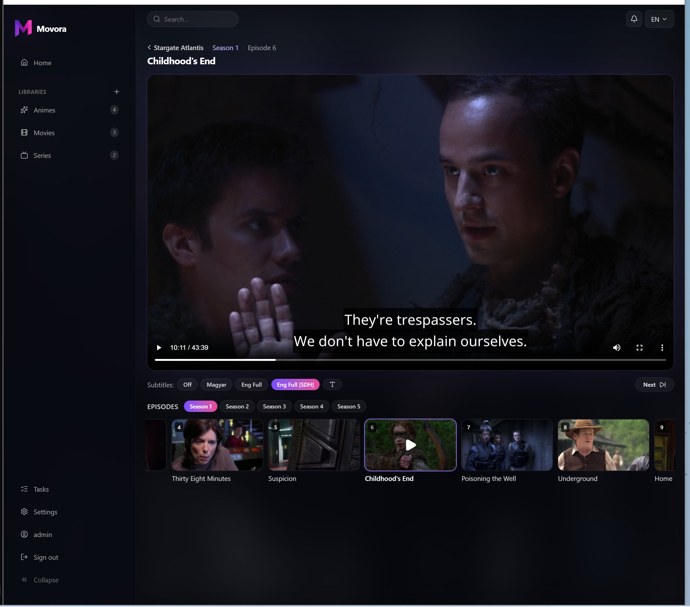
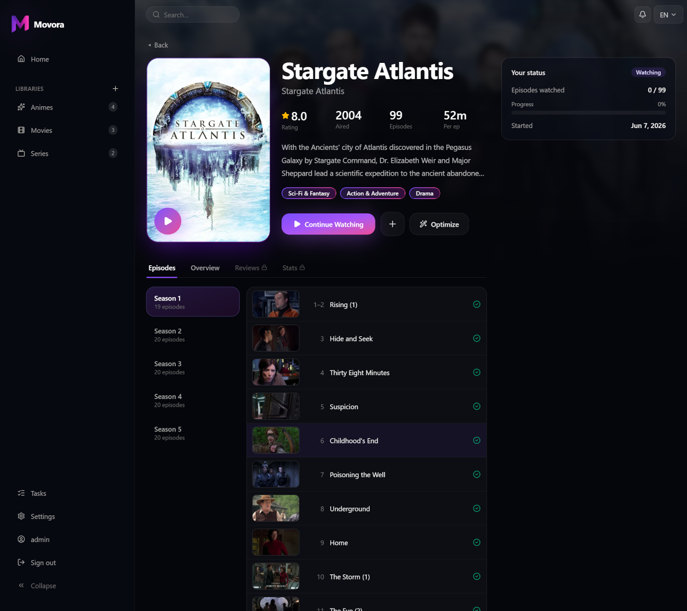
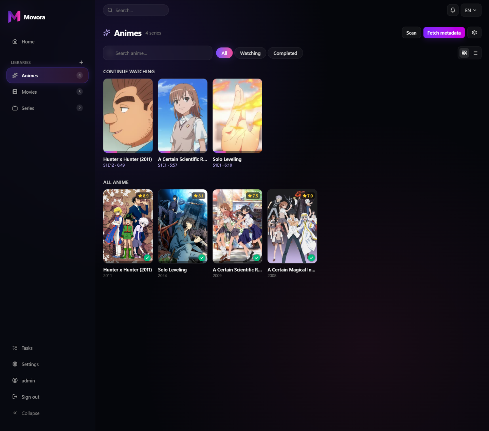
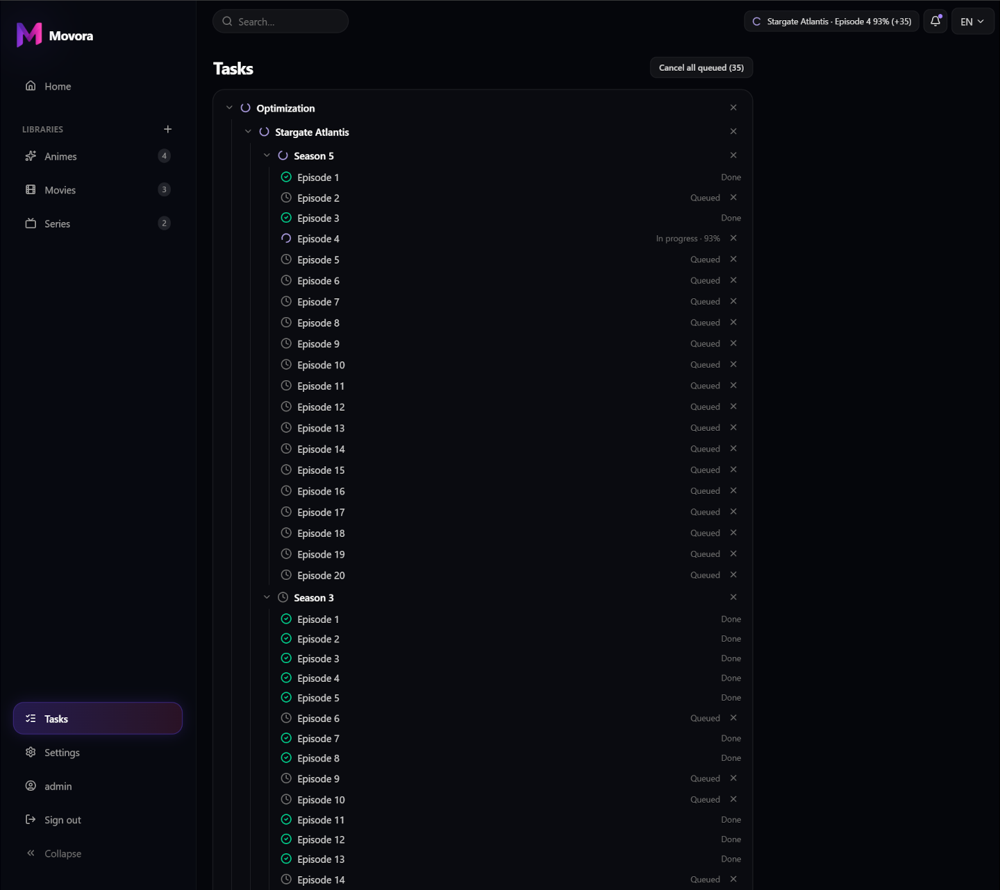
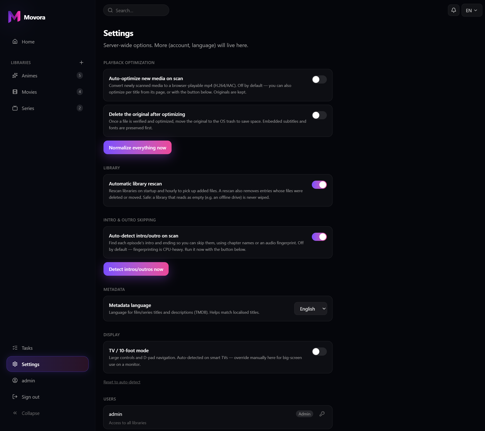
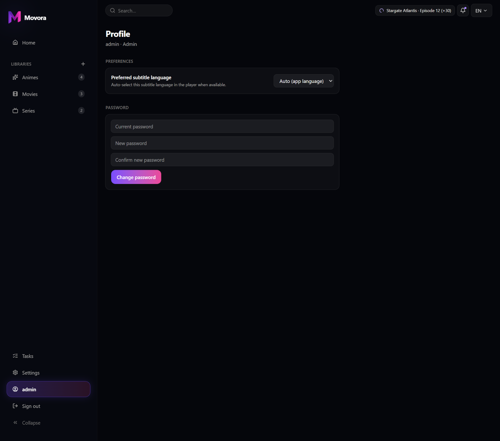
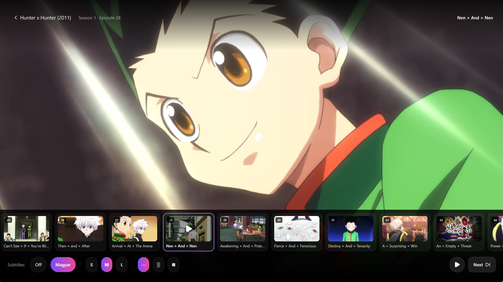

# Movora

**Lightweight, self-hosted media server for anime, film and series** — built on
**ingest-time normalization** instead of real-time transcoding, with **first-class
anime support**: a smart episode parser, a capability-aware subtitle pipeline that
preserves ASS styling, and an in-browser libass renderer.

The thesis: a power-efficient but weak box (e.g. an Intel N200 mini PC) can't
transcode in real time, so Movora normalizes each file **once, in the background**,
into a universally Direct-Play-able form — playback stays light. Where mainstream
servers struggle with anime (messy file names, absolute numbering, heavily typeset
ASS subtitles), Movora is built for it.



| Player — soft subtitles, skip-intro, episode browser | Series detail |
| :--: | :--: |
|  |  |
| **Library** | **Background processing** |
|  |  |
| **Settings — automation, intro detection & users** | **Profile** |
|  |  |

**TV player** — 10-foot UI with D-pad navigation, per-season episode carousel and subtitle controls:



## Features

- **Streaming + Direct Play** — HTTP range/seek; `.mkv` is optimized into a
  browser-playable mp4 on ingest, originals untouched.
- **Ingest normalization** — per-stream plan (copy H.264/8-bit, else transcode;
  audio → AAC; mp4 + faststart), hardware encoder auto-detected (QSV/NVENC/AMF/
  VideoToolbox → libx264), idempotent + verified, with an in-process task queue.
- **Subtitle pipeline** — sidecar + embedded discovery, encoding normalization,
  and `clean_ass`: classify dialogue vs. signs/songs and produce an SRT fallback,
  with a per-group override layer. Soft ASS is rendered in-browser by **JASSUB**
  (libass/WASM); adjustable size and background.
- **Metadata** — AniList for anime, TMDB for film/series (localized), MyAnimeList
  episode titles, and cast on the detail page.
- **Intro / outro detection + skip** — chapter names first, else a Chromaprint
  audio fingerprint matched across a season; a Skip button in the player.
- **TV player (10-foot UI)** — a fullscreen overlay optimized for smart-TV
  D-pad remotes: spatial navigation, skip-intro/outro chip, per-season episode
  carousel, and subtitle appearance controls (size + background).
- **Continue watching, per-episode thumbnails, overall progress, global search.**
- **Multi-user + RBAC** — a login gate, admin/viewer roles, and **per-user library
  access** (grant a viewer only the libraries they may watch).
- **Responsive UI** — a collapsible sidebar that becomes a drawer on mobile.

## Quick start (Docker)

```bash
cp .env.example .env          # then set MOVORA_SECRET_KEY (see below)
docker compose up --build     # http://localhost:8000
```

On first run, open the app and create the **admin account** (one-time setup).
Add a library with the **+** button, point it at a media folder, and Movora scans,
fetches metadata and (optionally) normalizes it in the background.

### Configuration

Settings are environment variables prefixed with `MOVORA_` (see `.env.example`):

- **`MOVORA_SECRET_KEY`** — **required in production**; signs the login session
  cookie. Generate one with `python -c "import secrets; print(secrets.token_hex(32))"`.
- `MOVORA_TMDB_API_KEY` — free [TMDB v3](https://www.themoviedb.org/settings/api)
  key for film/series metadata (anime works without it).
- `MOVORA_DATABASE_PATH`, `MOVORA_MEDIA` — see `.env.example`.

## Development

```bash
# backend (from backend/)
python -m venv .venv && .venv/bin/pip install -e ".[dev]"
.venv/bin/alembic upgrade head
.venv/bin/uvicorn movora.api.app:app --reload      # http://localhost:8000

# frontend (separate terminal, from frontend/)
npm install && npm run dev                          # http://localhost:5173 (proxies the API)
```

Checks (also enforced in CI):

- Backend: `ruff check .`, `mypy`, `pytest`.
- Frontend: `npm run test` (Vitest), `npm run build` (tsc + bundle), `npm run e2e` (Playwright).

## Architecture

Movora is built behind stable interfaces (`ParserStrategy`, `MetadataProvider`,
`NormalizationPlanner`, `StreamStrategy`, `SubtitleResolver`, `JobQueue`,
`AuthProvider`), with a central `CapabilityProfile` deciding what a client can play.
Later features attach as new implementations rather than rewrites.

- `backend/` — Python + FastAPI, SQLAlchemy 2.0 + Alembic, SQLite/WAL, ffmpeg/ffprobe.
- `frontend/` — React + Vite + TypeScript (strict).
- `Dockerfile` / `compose.yaml` — container distribution; `install.sh` / `systemd/` — native.

## Roadmap (v2)

Real-time transcode (QuickSync) + adaptive HLS, AniList/MAL scrobbling, AniDB
hash-based matching, an anime franchise/collection model with a chronological
watch-order view, an ML dialogue-vs-signs classifier trained on the override data,
and subtitle acquisition.

## License

MIT — see [LICENSE](LICENSE). Third-party components and their licenses are listed
in [THIRD_PARTY_NOTICES.md](THIRD_PARTY_NOTICES.md) (notably the vendored
MPL-2.0 anitopy parser and the OFL-1.1 Noto Sans font).
